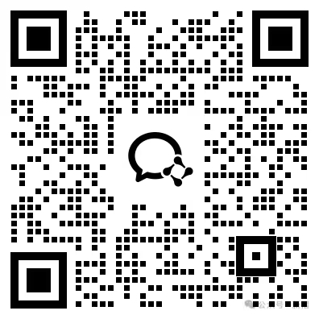

# md2video

[](https://github.com/leether/md2video/releases)
[](LICENSE)
[](https://www.python.org/)
[](https://github.com/leether/md2video/commits/main)
[](https://github.com/leether/md2video/actions/workflows/ci.yml)
[](https://github.com/leether/md2video/stargazers)
[](https://github.com/leether/md2video)

> *每次手动拼接视频，不是音画错位就是素材遗漏。后来写了个 pipeline，从文章到成品视频一条命令搞定，还自带免疫系统——越用越聪明。*

从 Markdown 文章或纯文本出发，**分镜拆解 → 语义分段 → 精确时轴 → 智能拼接** 四位一体。内置 9 种纯 Python 动画模板降低外部 API 依赖，**三层质检**（L1 硬阻塞 / L2 警告 / L3 模式检查）+ **自创生免疫系统**（SelfReport 自动捕获摩擦、演化规则、更新活记忆）确保不翻车。

```
┌─────────────────────────────────────────────────────────────────────────┐
│                         md2video 四层架构                                │
├─────────────────────────────────────────────────────────────────────────┤
│                                                                         │
│   Markdown / 文章输入                                                    │
│       ↓                                                                 │
│   ┌──────────────┐  storyboard_ai（规则驱动分镜拆解）                   │
│   │  分镜拆解层  │  hook→narrative→data_contrast→list→cta              │
│   └──────┬───────┘  自动推断 segment_type + transition                 │
│          ↓                                                              │
│   ┌──────────────┐  segment_tts + edge-tts                             │
│   │  语音生成层  │  语义边界切分 → 独立 TTS → ffprobe 精确测时长        │
│   └──────┬───────┘                                                      │
│          ↓                                                              │
│   ┌──────────────┐  timeline_mapper + concat_engine                    │
│   │  时轴拼接层  │  快速路径(-c copy) / 特效路径(filter_complex)       │
│   └──────┬───────┘  xfade / acrossfade / fade 自动路由                 │
│          ↓                                                              │
│   ┌──────────────┐  harness(L1/L2/L3) + frame_extractor               │
│   │  质检回检层  │  三方一致性 / 黑帧检测 / 文字重叠 / emoji 方块       │
│   └──────┬───────┘                                                      │
│          ↓                                                              │
│   ┌──────────────────┐  self_report.py（Autopoiesis 免疫系统）         │
│   │  自创生演化层    │  摩擦点捕获 → 规则自动演化 → 活记忆更新         │
│   └──────────────────┘                                                  │
│                                                                         │
│   → final.mp4 + compliance_report.json + 活记忆 LESSONS_LEARNED.md     │
│                                                                         │
└─────────────────────────────────────────────────────────────────────────┘
```

## ⚡ 一句话安装

把下面这段话直接发给你的 AI Agent，即可自动完成克隆 + 链接 + 配置：

```
安装 Skill：从 https://github.com/leether/md2video 克隆，创建符号链接到 ~/.workbuddy/skills/md2video，然后运行 uv pip install -r requirements.txt 并提醒我安装 ffmpeg
```

> 适用于 WorkBuddy、Claude Code 等支持 Skill 安装的 Agent。手动安装见[下方](#安装)。

## 适合 / 不适合

**适合你，如果：**
- 你有 Markdown 文章或文案，想一键转成带旁白的短视频
- 你需要数据可视化动画（柱状图、趋势图、对比画面），不想每次都调即梦
- 你想让 AI Agent 自动走完「文章→分镜→TTS→拼接→质检」全流程
- 你希望系统越用越聪明——每次出错的教训自动变成规则

**不适合你，如果：**
- 你需要电影级特效——这是程序化拼接，不是 After Effects
- 你只需要纯图片轮播——剪映可能更快
- 你不接受命令行工具——没有 GUI

## 一分钟跑起来

```bash
git clone https://github.com/leether/md2video.git
cd md2video

# 安装依赖
uv pip install -r requirements.txt
# 系统依赖
brew install ffmpeg

# 一键分镜 + 生成 pipeline 输入
python -c "
from extensions.storyboard.storyboard_ai import storyboard_from_article
article = '''# 示例文章

第一段是 hook，吸引注意力。

第二段展示数据对比：价格上涨 30%。

最后引导关注。
'''
storyboard_from_article(article, output_dir='output')
"

# 运行自检
python harness/self_report.py

# 治理 dry-run（不调用外部素材/TTS 服务）
python scripts/orchestrator.py \
  --input examples/example_article.md \
  --output-dir output/dry-run \
  --dry-run \
  --skip-command-checks \
  --allow-dirty-output
```

零外部 API 依赖即可运行语法检查和自检。即梦 CLI 仅在有 AI 素材需求时需要。

## 完整流程

```
Markdown 文章 / 纯文本
  ↓ Step 0：分镜拆解（storyboard_ai.py）
shots.json + prompts.json + transitions.json
  ↓ Step 1：分段 TTS（segment_tts.py）
segments.json（含精确时长 + 语义类型）
  ↓ Step 2：素材生成（jimeng CLI / animation_templates）
scenes/ 目录（视频/图片/动画素材）
  ↓ Step 3：时轴映射（timeline_mapper.py）
timeline.json（Clip 模型，含 fade/transition）
  ↓ Step 4：精确拼接（concat_engine.py）
final.mp4（快速路径 / 特效路径自动选择）
  ↓ Step 5：质检回检（harness.py）
compliance_report.json（L1/L2/L3 报告）
  ↓ Step 6：自创生演化（self_report.py）
LESSONS_LEARNED.md 更新 + video-rules.json 规则演化
✅
```

### Step -1：治理预检和运行证明

正式生成前先跑治理 dry-run，确认本仓入口、规则、CTA 资源和自检链路是自洽的：

```bash
python scripts/preflight.py \
  --input examples/example_article.md \
  --skip-command-checks \
  --json

python scripts/orchestrator.py \
  --input examples/example_article.md \
  --output-dir output/dry-run \
  --dry-run \
  --skip-command-checks \
  --allow-dirty-output
```

`scripts/orchestrator.py` 当前是治理外壳，不会调用付费或远程素材生成服务。它会写入：

- `.md2video-pipeline.jsonl`：每个治理步骤的结构化日志
- `output/dry-run/run-manifest.json`：输入 hash、仓库状态、环境版本、关键产物指纹和步骤结果

CI 也会跑这一套 dry-run，防止入口契约、QR registry、导入路由或 self-report no-write 行为漂移。

### Step 0：分镜拆解

**规则驱动，无需改代码。** 将文章输入 `storyboard_ai.py`，自动输出：

- `shots.json`：每段分镜（id / text / visual_type / duration_hint）
- `prompts.json`：即梦 prompt 或动画参数
- `transitions.json`：段间转场配置（自动从 `rules/storyboard_rules.json` 推断）

语义类型（hook / narrative / data_contrast / list / date / quote / cta）决定使用 AI 素材还是 Python 动画。

### Step 1：分段 TTS

```bash
python core/segment_tts.py --input output/segments_hint.json --output output/segments.json
```

- 按语义边界切分（句号/分号/逻辑转折）
- 独立生成 TTS，避免长文本 edge-tts 截断
- `ffprobe` 精确测量每段时长
- 自动推断 `segment_type`，写入 segments.json 供下游使用

### Step 2：素材生成

**AI 素材**（需要即梦 CLI）：
```bash
jimeng video generate --prompt "Cinematic shot..." --model seedance2.0fast_vip
```

**Python 动画**（零外部依赖，9 种模板）：
```python
from extensions.animations.animation_templates import render_animation

# 柱状图
render_animation("bar_chart", {"data": [("Q1", 100), ("Q2", 150)]}, duration=5.0)

# 要点列表
render_animation("bullet_list", {"items": ["第一点", "第二点", "第三点"], "title": "核心结论"})

# 日历高亮
render_animation("calendar_highlight", {"year": 2026, "month": 6, "highlight_day": 7})

# 引用卡片
render_animation("quote_card", {"quote": "这是金句", "author": "作者名"})
```

### Step 3：时轴映射

```bash
python core/timeline_mapper.py --segments output/segments.json --prompts output/prompts.json
```

- **三方一致性校验**（L1 硬阻塞）：segments.json ↔ prompts.json ↔ scenes/ 目录
- 自动从 `transitions.json` 加载转场配置
- 输出 `timeline.json`（Clip 模型，含 fade_in / fade_out / transition）

### Step 4：精确拼接

```python
from core.concat_engine import ConcatEngine
from core.timeline_mapper import TimelineMapper

clips = TimelineMapper.load_timeline("output")
engine = ConcatEngine(resolution=(1080, 1920), fps=30)
engine.concat(clips, "output/final.mp4")
```

- **快速路径**：无特效时用 `concat demuxer + -c copy`
- **特效路径**：有 fade/transition 时用 `filter_complex`（xfade + acrossfade）
- 失败自动降级到快速路径

### Step 5：质检回检

```bash
python harness/harness.py --video output/final.mp4 --timeline output/timeline.json
```

**L1 硬阻塞**（失败即阻断）：
- 三方一致性、placeholder=0、计算一致性、音频存在性、timeline 完整性

**L2 警告**（失败可继续）：
- 音画差值、分辨率匹配、帧率方差、段落时长合理性

**L3 模式检查**（自动+人工）：
- 箭头方向语义、颜色语义、emoji 兼容性、二维码完整性、转场有效性

### Step 6：自创生演化

```bash
python harness/self_report.py --capture "素材遗漏" "s22 缺失" "补充生成 s22"
```

- 捕获摩擦点 → 自动编码进 `video-rules.json` → 更新 `LESSONS_LEARNED.md`
- 新增语义类型只需改 `rules/*.json`，无需改代码
- 系统越用越聪明

## 目录结构

```
md2video/
├── core/                          # 核心引擎层
│   ├── segment_tts.py             # 分段 TTS + 语义类型推断 + 精确测时长
│   ├── timeline_mapper.py         # 程序化 timeline + Clip 模型
│   ├── concat_engine.py           # 精确时轴拼接（双路径）
│   ├── frame_extractor.py         # 抽帧检查
│   └── cta_resource.py            # CTA 二维码资源治理
├── harness/                       # 质检 + 免疫系统
│   ├── harness.py                 # L1/L2/L3 分层合规检查
│   ├── self_report.py             # Autopoiesis 自检自报告 + 规则演化
│   └── video-rules.json           # 规则定义（可自演化）
├── rules/                         # 规则层（运行时加载）
│   ├── segment_types.json         # 语义段落类型规则
│   └── storyboard_rules.json      # 分镜拆解 + 转场推断规则
├── extensions/                    # 扩展模板层
│   ├── animations/                # Python 动画模板（9 种）
│   ├── prompt_templates/          # 即梦 prompt 模板
│   └── storyboard/                # 文章→分镜拆解器
├── docs/
│   └── LESSONS_LEARNED.md         # 活记忆器官（YAML frontmatter）
├── examples/                      # 示例
├── .github/workflows/ci.yml       # CI
├── requirements.txt               # Python 依赖
├── SKILL.md                       # 完整 Skill 文档
└── README.md                      # 本文件
```

## 安装

```bash
# 克隆
git clone https://github.com/leether/md2video.git
cd md2video

# Python 依赖
uv pip install -r requirements.txt

# 系统依赖
brew install ffmpeg

# 可选：即梦 CLI（用于 AI 素材生成）
# npm install -g jimeng-cli
```

## 依赖

- Python 3.10+
- ffmpeg（Homebrew: `brew install ffmpeg`）
- edge-tts
- Pillow
- numpy
- 即梦 CLI（可选，用于 AI 素材）

## 交流群 & 姊妹项目

<p align="center">
  
  <br>
  <b>扫码加入交流群</b>，一起探索 AI 自动化内容生产
</p>

### 姊妹项目

| 项目 | 用途 | 链接 |
|------|------|------|
| **md2video** ⬅ 当前 | Markdown / 文章 → 短视频 | [github.com/leether/md2video](https://github.com/leether/md2video) |
| **md2wechat** | Markdown / 文章 → 公众号排版 & 推送 | [github.com/leether/md2wechat](https://github.com/leether/md2wechat) |

> 同一套自创生（Autopoiesis）免疫系统：越用越聪明，每次出错自动变成规则。

## 许可证

MIT License — 见 [LICENSE](LICENSE) 文件。
